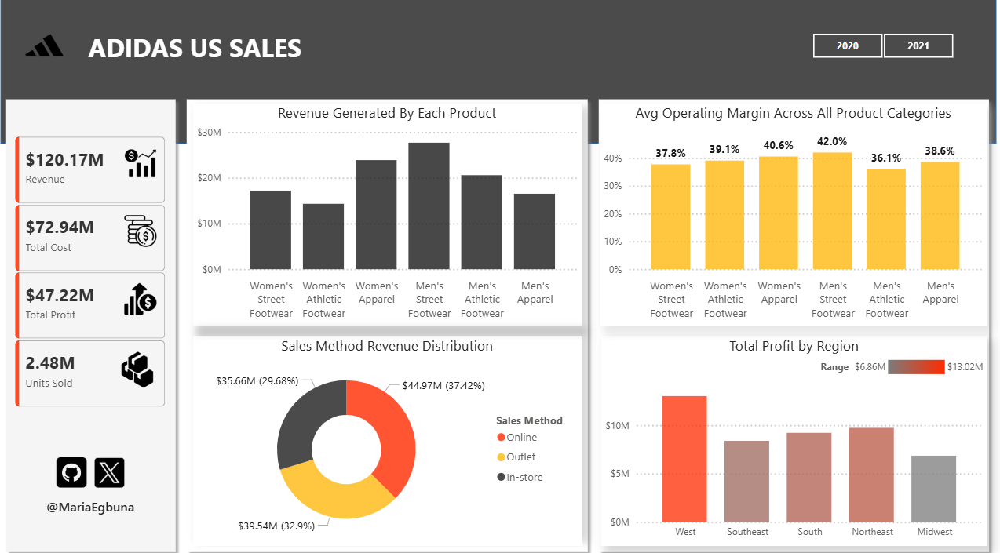
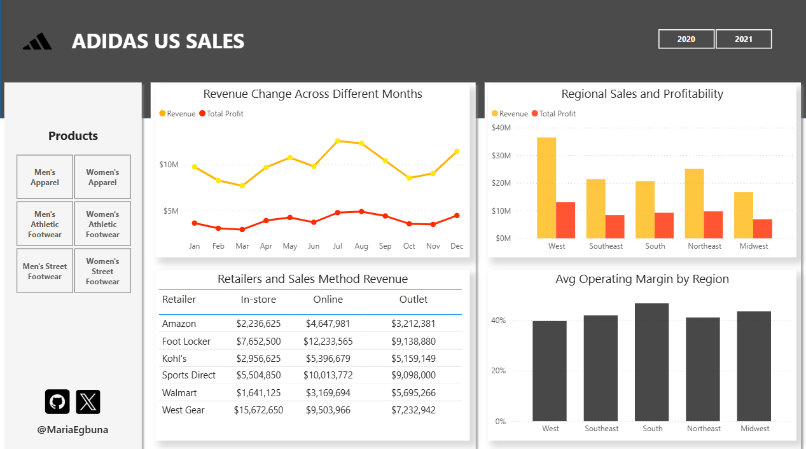
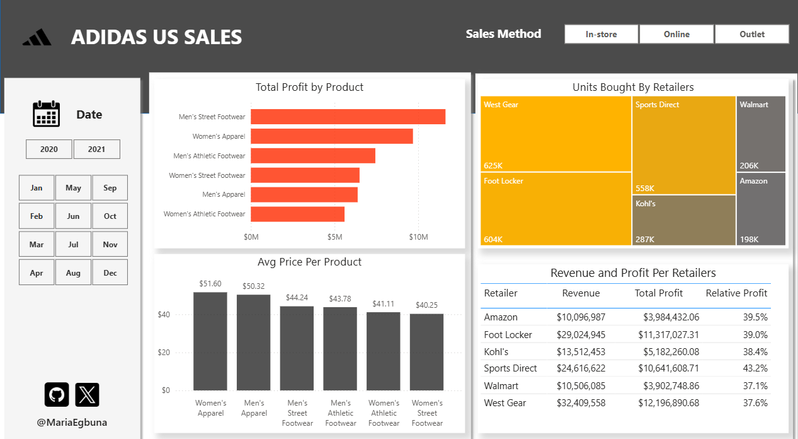

# Adidas US Sales (2020-2021)

## Dataset Overview
This dataset contains detailed sales information for Adidas products within the United States. It provides a comprehensive view of various aspects of sales operations, including:
* **Retailer Information:** Details about the retailers involved in the sales.
* **Product Details:** Information about the specific Adidas products sold.
* **Sales Figures:** Quantity of units sold and the total revenue generated.
* **Profitability Metrics:** Data related to operating profit and margin.
* **Geographical Data:** Sales broken down by region, state, and city.
* **Sales Method:** How the sales were conducted (e.g., online, in-store).
* **Date Information:** The invoice date for each transaction.

---
## Data Cleaning Performed
Prior to further analysis, a critical data cleaning step was executed using Microsoft Excel:
* **Issue:** The original `Total Sales` column values were identified as potentially inaccurate or inconsistent with the `Price per Unit` and `Units Sold` columns.
* **Correction:** The `Total Sales` column was **recalculated for all rows by multiplying the `Price per Unit` by the `Units Sold`**. This ensures that the total sales figures accurately reflect the product of unit price and quantity sold.
* **Result:** The `Total Sales` column is now accurate and consistent, ensuring the integrity of the sales figures for reliable analysis.

## Exploratory Data Analysis
This project conducts an Exploratory Data Analysis (EDA) on the Adidas US Sales dataset. The analysis leverages the detailed sales records, including `retailer`, `invoice_date`, `region`, `product`, `price_per_unit`, `units_sold`, `total_sales`, `operating_profit`, `operating_margin_percent`, and `sales_method`.

---
## Analysis Goals

The EDA was structured around several key areas of inquiry:
1.  **Performance Analysis**: Examining overall sales and profit performance.
2.  **Regional and Temporal Trends**: Investigating how sales and profit vary by geographic region and over time.
3.  **Profitability Insights**: Deep diving into profit margins across different dimensions.
4.  **Product-Specific Analysis**: Looking closely at individual product performance metrics.

## Tools Used
* **Microsoft Excel**: For initial data cleaning and preparation.
* **PSQL (PostgreSQL)**: The relational database management system for data storage and retrieval.
* **SQL**: Primary language used for data extraction and aggregation.

---
## Key Analysis Questions

Here are the main questions explored during this EDA. For detailed answers and insights, please refer to the [`Results.md`](Results.md) file. The SQL queries used to answer these questions can be found in [`Adidas_Sales_EDA.sql`](Adidad_Sales_EDA.sql).

### Performance Analysis
* What is the total revenue generated by each product category?
* Which sales method (In-store vs. Outlet vs. Online) generates the highest revenue across all products?
* What is the average operating margin across all product categories?
* Which region generates the highest profit, and which has the lowest?

---

### Regional and Temporal Trends
* How does the total revenue change across different months?
* Which region contributes the most to the total sales, and does it align with the highest profitability?
* What are the retailers sales distribution?
* Average profit margin by regions?

---

### Profitability Insights & Product-Specific Analysis
* Which product category has the highest operating profit across all sales methods?
* What is the average price for products sold via In-store vs. Outlet methods?
* What is the average units sold per day for each product category?
* Which retailers had the lowest profit percentage, and how can this be improved?

---

## How to Reproduce the Analysis

To reproduce this analysis, follow these steps:

1.  **Database Setup:** Ensure you have a PostgreSQL database instance set up and a client like DBeaver connected.
2.  **Load Data:** Import the `Adidas_US_Sales.csv` file into a table named `adidas_sales_data` in your PSQL database. Ensure appropriate data types for columns (e.g., `invoice_date` as `DATE`, `price_per_unit` as `NUMERIC`, `units_sold` as `INTEGER`, `total_sales`, `operating_profit` as `NUMERIC`, `operating_margin_percent` as `NUMERIC`). Remember to apply the data cleaning steps mentioned above (recalculating `total_sales`) to ensure data integrity.
3.  **Run Queries:** Execute the SQL queries from the [`Adidas_Sales_EDA.sql`](Adidas_Sales_EDA.sql) file within your PSQL environment to obtain the analysis results.
