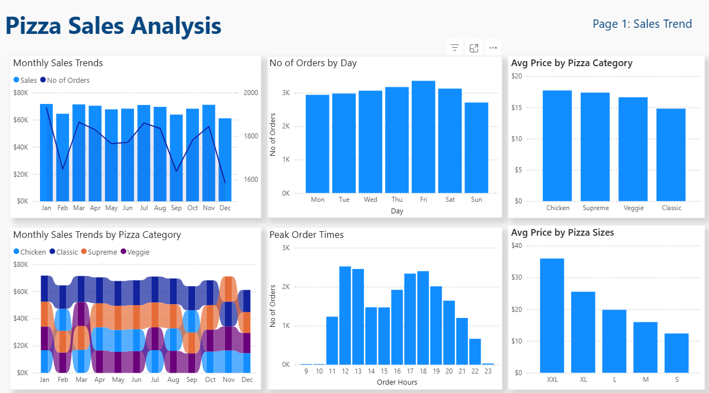
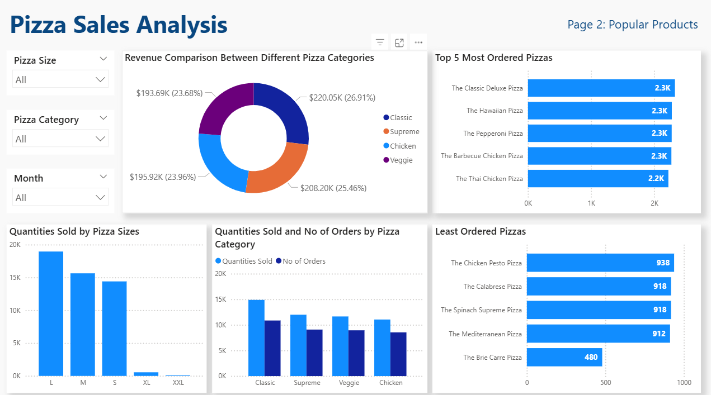
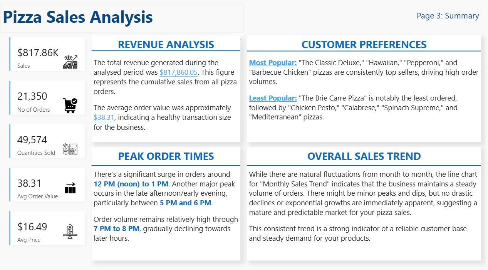

# Pizza Sales (2015)

## Project Overview
This project involves an in-depth analysis of a pizza sales dataset to uncover key trends, customer preferences, and operational insights. By examining historical sales data, I identify peak periods, popular products, and revenue drivers, providing actionable intelligence for business optimization.

## Dataset
The analysis is based on the `pizza_sales.csv` dataset, which contains detailed records of individual pizza orders. Each row represents a pizza item sold within an order and includes the following columns:
* `pizza_id`: Unique identifier for each pizza sold.
* `order_id`: Identifier for the overall order.
* `pizza_name_id`: Short identifier for the pizza name.
* `quantity`: Number of units of the specific pizza item in the order.
* `order_date`: Date when the order was placed.
* `order_time`: Time when the order was placed.
* `unit_price`: Price of a single unit of the pizza.
* `total_price`: Total price for the quantity of the specific pizza item (quantity * unit_price).
* `pizza_size`: Size of the pizza (e.g., S, M, L, XL, XXL).
* `pizza_category`: Category of the pizza (e.g., Classic, Veggie, Supreme, Chicken).
* `pizza_name`: Full name of the pizza.

---
## Analysis Questions & Insights
The analysis addressed several key questions to extract valuable insights from the pizza sales data:
1.  **What are the peak order times for pizzas?**
    * **Insight:** Peak order times are consistently around **12 PM - 1 PM (lunchtime)** and **5 PM - 7 PM (dinner time)**, indicating high demand during traditional meal hours.

2.  **Which days have the highest number of orders?**
    * **Insight:** **Friday, Saturday, and Thursday** are the days with the highest number of orders, with Friday being the busiest. Sunday generally has the lowest order volume.

3.  **Which pizza is the most ordered?**
    * **Insight:** **"The Classic Deluxe Pizza"** is the most frequently ordered pizza by quantity.

4.  **What is the most popular pizza size?**
    * **Insight:** The **Large (L)** size is the most popular pizza size, suggesting a preference for larger portions, possibly for groups or family meals.

5.  **What is the most popular pizza category (Classic, Veggie, Supreme)?**
    * **Insight:** The **"Classic"** pizza category is the most popular, indicating a strong customer preference for traditional and familiar pizza options.

6.  **Which pizza generates the highest revenue?**
    * **Insight:** **"The Thai Chicken Pizza"** generates the highest total revenue, highlighting its significant contribution to overall earnings, potentially due to its higher unit price or consistent demand.

7.  **What is the average order value?**
    * **Insight:** The average order value is approximately **$38.31**. This metric is crucial for understanding customer spending habits per transaction and identifying opportunities for upselling.

8.  **How does the revenue compare between different pizza categories?**
    * **Insight:** The **"Classic"** category leads in revenue, followed by "Supreme," "Chicken," and "Veggie." This shows the varying financial contributions of each category.

9.  **Is there a preference for vegetarian or non-vegetarian pizzas?**
    * **Insight:** There is a clear preference for **non-vegetarian pizzas**, which account for approximately 76% of both total revenue and total quantity sold, indicating a dominant market segment.

10. **How does the unit price of pizzas vary across different sizes and categories?**
    * **Insight:** Unit prices generally increase with size. Within sizes, "Chicken" and "Supreme" categories tend to have slightly higher average unit prices than "Classic" or "Veggie" pizzas, reflecting differences in ingredient cost or perceived value.

11. **Are there any time periods with unusually high or low sales?**
    * **Insight:**
        * **Highest Sales Day:** **2015-11-27 (Black Friday)** showed exceptionally high sales, indicating the effectiveness of special promotions.
        * **Lowest Sales Day:** **2015-03-22 (a Sunday)** recorded unusually low sales.
        * **Highest Sales Month:** **January 2015** had the highest monthly revenue.
        * **Lowest Sales Month:** **December 2015** had the lowest monthly revenue.

---
## Dashboard Overview

Here's a summary of the key insights from the Pizza Sales Dashboard.

### Sales Trend

### Popular Products

### Summary Page

---
## Tools and Technologies
* **Excel:** Used for data loading, manipulation, and initial analysis.
* **PSQL (PostgreSQL):** Used for writing and executing SQL queries to perform data aggregation and retrieval, simulating a database environment.
* **Power BI:** For Visualizations.

---
## How to Use/Run
To replicate this analysis:
1.  **Dataset:** Ensure you have the `pizza_sales.csv` file in your working directory.
2.  **SQL Queries:** Execute the PSQL queries in your PostgreSQL environment, ensuring the `pizza_sales` data is loaded into a table named `pizza_sales`.
